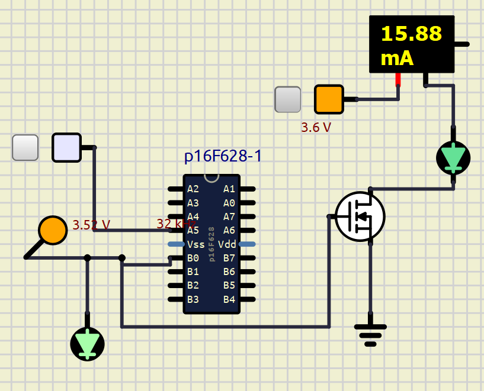
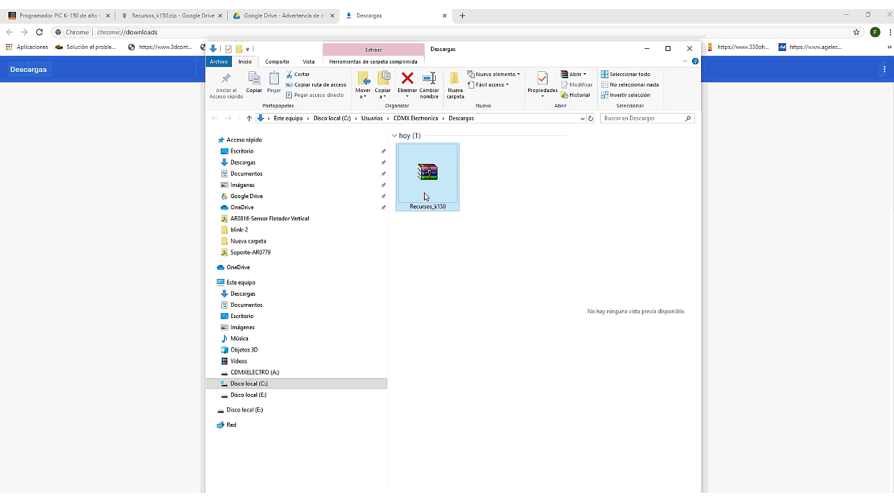
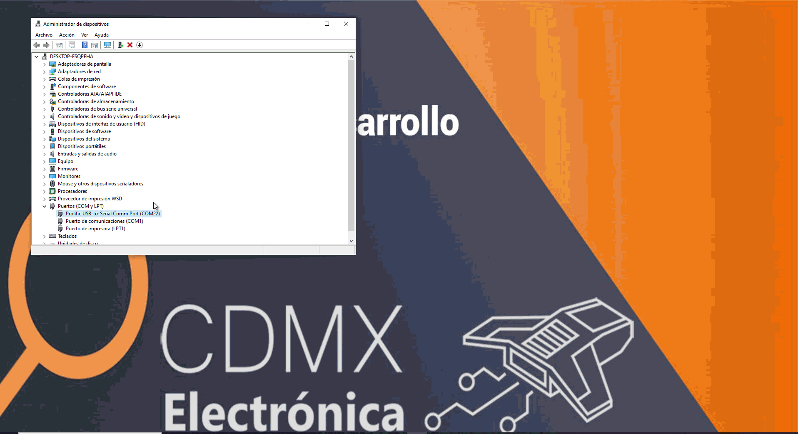
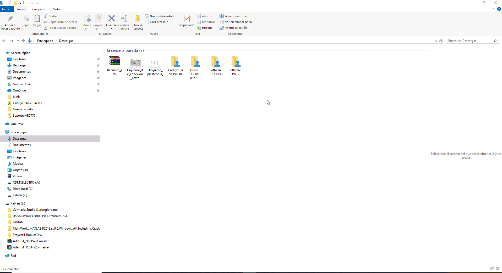

# Modulo de ahorro para sensores

Implementacion de un microcontrolador de bajo consumo y bajo costo (pic 16f628a) para el control de activacion de sensores basado en tiempo con el apoyo de un mosfet para encender y apagar el sistema principal, segun hoja de datos, el consumo del pic usando reloj interno de bajo poder (LP) es de 32uA

en PB0 se implemente el Gate de MOSFET

en PA5 se implementa entrada de activacion desde el microcontrolador

no se implementa reloj externo

# Diagrama Cicuital

** La siguiente información fue tomada de este [enlace](https://blog.uelectronics.com/electronica/aprende-con-nuestro-tutorial-a-programar-el-pic-k-150/), créditos a sus respectivos autores.**

# Instalación driver prolific

Para descargar los programas y los controladores necesarios, por favor accede al enlace  [Recursos K150](https://blog.uelectronics.com/wp-content/uploads/2024/02/Recursos-Programador-K150.zip). Posteriormente sigue los siguientes pasos:

1. Una vez descargado el archivo .ZIP, descomprímelo y procede a instalar el controlador PL2303_Prolific en tu PC. Este controlador es compatible con sistemas operativos Windows 7, 8, 10 y 11.

En el siguiente GIF podrás ver los pasos de instalación:

2. Luego, conecta el módulo a tu PC y dirígete al “Administrador de dispositivos”. Si aparece una señal de error amarilla en el puerto COM, es necesario actualizar el controlador. Del mismo modo, si no se muestra ningún error, debes proceder a actualizar el controlador de la siguiente manera:

3. En este caso, el puerto COM asignado es el número “22”, el cual consta de dos cifras. Para garantizar el correcto funcionamiento del módulo con el programa “DIY K150”, es necesario modificar el número del puerto para que sea de una sola cifra.

En el siguiente GIF, podrás ver cómo realizar el cambio. Recuerda que el número debe ser del 1 al 9 y no debe estar asignado a ningún otro dispositivo.

# Verificación de la instalación del driver

4. Para verificar la correcta instalación del controlador y la ejecución de los pasos anteriores, abre el programa “PL2303_CheckChipVersion_v1006”, selecciona el puerto COM asignado al módulo de programación y haz clic en “Check”

Deberías ver el siguiente mensaje: “This is a PL-2303 XA / HXA chip”, e. Esto confirma que la compatibilidad es correcta. Si te aparece un error, es probable que no hayas actualizado el controlador mencionado en el punto 2. Te recomiendo repetir el proceso y volver a intentarlo.

5. Una vez verificada la compatibilidad del Chip y la instalación del driver, estamos listos para verificar el funcionamiento del programador k150. Abre el programa “microbrn” que lo encontraras el archivo .zip que descargaste al inicio del tutorial.

Lo encontraras en la carpeta “Software -DIY K150”.

En el siguiente GIF, podrás observar cómo programar el PIC16F628A insertándolo en el zócalo ZIF de 40 pines, así cómo los pasos para cambiar el puerto COM y no tener errores.

